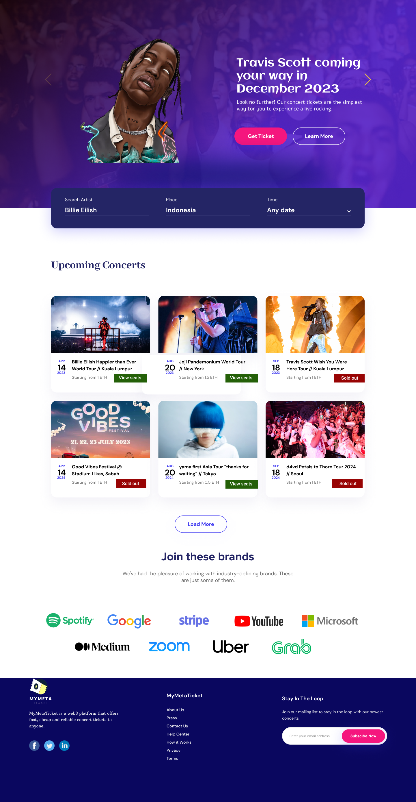
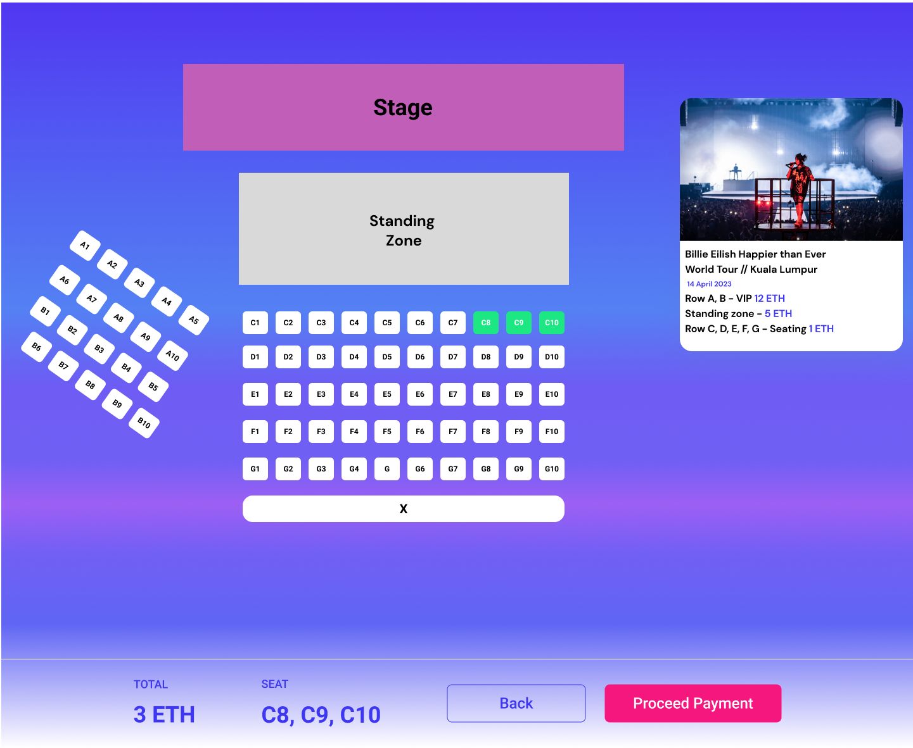
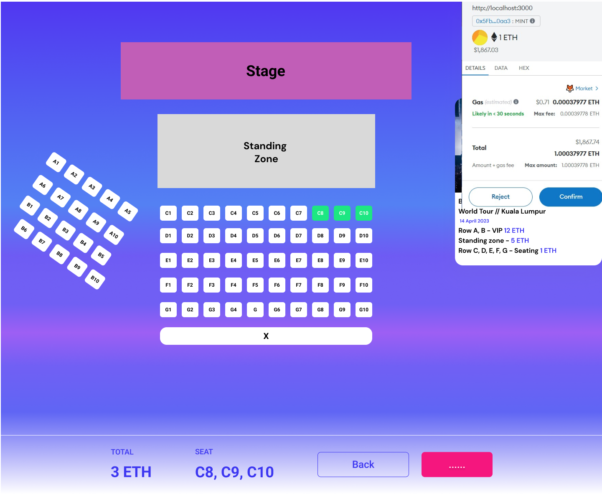

# MYMetaTicket

MYMetaTicket is a decentralized NFT ticket platform for any events. Buy NFT tickets for upcoming events quickly and easily by using the Solana blockchain. Our mission is to deliver a superior NFT ticket experience that rivals industry titans such as LiveNation and Tickets2u. Lengthy purchasing processes and excessive fees will soon be a thing of the past, not to mention the burdensome tasks required to resell and transfer tickets on existing platforms.

## Screenshots

## What are the features in our system?

- Event Listings: View a list of upcoming events and their details, including event name, date, venue, and available tickets.
- Ticket Purchase: Buy tickets for desired events.
- Smart Contract Integration: Utilize Solidity smart contracts to handle the ticket purchasing process securely and transparently.
- Metamask Integration: Connect with your Metamask wallet to make seamless transactions.

## What is needed for the Initial Setup?
- Would need installation of Node. Js and Installation of MetaMask wallet

## Installation Process

1. Install the dependencies: `npm install`
2. Run tests: `npx hardhat test`
3. Start Hardhat node: `npx hardhat node`
4. Run deployment script In a separate terminal execute: `npx hardhat run ./scripts/deploy.js --network localhost`

## Contact
Feel free to contact us in case you need any assistance

Enjoy the secure and transparent ticketing experience with MYMetaTicket!
